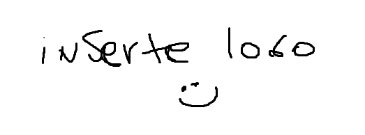
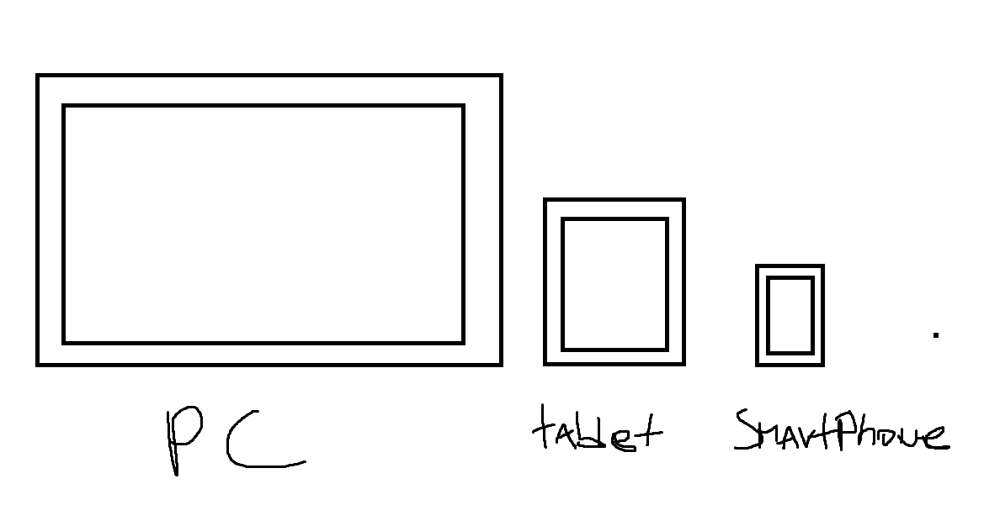

# PrograCademia

PrograCademia es un sitio web pensado en ayudar a profesores en hacer sus clases mas entretenidas y didacticas, y al mismo tiempo a los alumnos que quieran aprender de manera autonoma.

en progracademia nos enfocamos en los estudiantes que recien estan comenzando en la programacion, dentro de nuestros "Quiz" estan:

- Conceptos Basicos de la programacion (variables, bucles y estructuras de control.)
- Html
- CSS
- JavaScript
- Python

este sitio se crea en base a una problematica muy comun en este mundo, la poca didactica en este aprendizaje, ya que debido a esto, los conceptos basicos que son muy importantes para este mundo se llegan a omitir lo cual es algo que podria perjudicar a esta persona en un futuro.

PrograCademia es un sitio web responsivo , por lo cual se puede adaptar a cualquier dispositivo, ya sea un computador, tablet, smartphone, etc.

