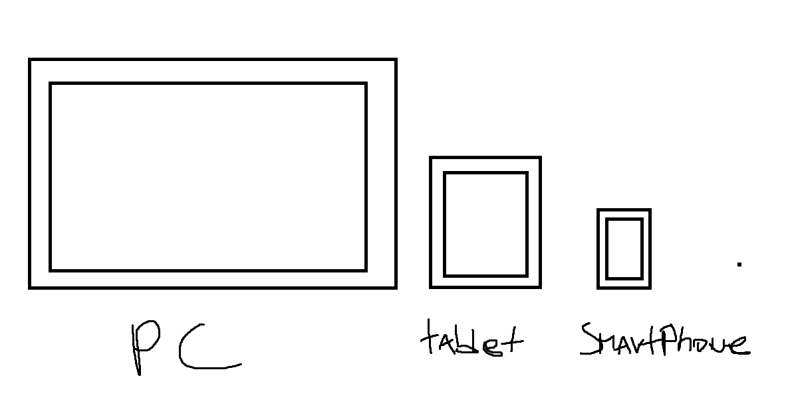

# "Nombre del sitio"

"nombre del sitio" es un sitio web creado con nodejs y socket io para ayudar a futuros programadores a que aprendan de una forma didactica, simple e interactiva a entender los conceptos basicos de la programacion, ya sea en distintos lenguajes como:
- pseudocodigo
- html
- python
- etc

este sitio se crea en base a una problematica muy comun en este mundo, la poca didactica en este aprendizaje, ya que debido a esto, los conceptos basicos que son muy importantes para este mundo se llegan a omitir lo cual es algo que podria perjudicar a esta persona en un futuro.

"nombre del sitio" es un sitio web responsivo , por lo cual se puede adaptar a cualquier dispositivo, ya sea un computador, tablet, smartphone, etc.

